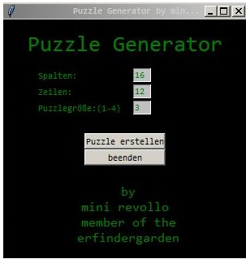
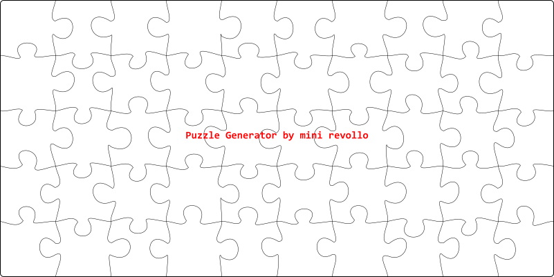

# Puzzle-Generator

Ein Programm in **Python 3.5** um Puzzle zu generieren. Die Puzzle Datei wird als SVG abgespeichert.

Der Generator gestaltet **jede einzelne Nase** etwas **anders**. Wie auf dem Bild zu erkenne ist benötigt man für eine Nasen (entspricht einer Seite eines Puzzelteiles) 4 Punkte (rot) und 6 Punkte (grün). Die grünen Punkte beeinflußen die Form der Biegungen. 

Per **Zufallsgenerator** werden die Punkte mit ihren x und y Koordinaten innerhalb der Rechteck erzeugt. Durch verschieben der Rechtecke, also Veränderung des Bereichs der Zufallszahlen, kann eine tendenziell breitere/schmälere oder kürzere /längere Nase erzeugt werden. 

Um ein ruhiges Puzzelbild zu erzeugen bleiben die Punkte p1 und p2 mit den Punkten c1 und c6 immer gleich. 

Das Programm erzeugt zuerst eine Einleitung für eine SVG-Datei. Anschließend wird eine Nase nach der anderen berechnet und die Punkte werden in die SVG-Datei als Pfad geschrieben. Es ergibt sich so jeweils ein Pfad pro Zeile und ein Pfad pro Reihe.

Zum Abschluß wird noch ein **Rechteck** mit abgerundeten Ecken als Einfassung generiert und ein **Branding** auf das Puzzle gesetzt.

Im **GUI** (Grafik user interface) kann die Anzahl der gewünschten Puzzleteile eingegeben werden.

So sieht dann das fertige Puzzle aus.

